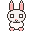

# Pixelbnnuy 🐰

A pixel-art desktop pet bunny that lives on your Windows desktop as a transparent floating companion. Built with Python, PySide6, and procedurally generated pixel art.



## Features

### 🎭 Behavioral States
| State | Trigger | Visual |
|-------|---------|--------|
| **Idle** | Default | Gentle breathing bounce, random blinks |
| **Nibble** | Auto (random) | Eating a carrot with head bob |
| **Look** | Auto (random) | Eyes follow cursor, looking around |
| **Pet** | Hover over bunny | Happy face (^_^), blush, relaxed ears |
| **Stretch** | Single click | Full-body stretch/yawn animation |
| **Drag** | Click & drag | Move bunny, elastic squish/stretch |
| **Hunt** | Fast cursor near bunny | Alert crouch, wide eyes, tracking |
| **Typing** | Keyboard activity | Paw tapping animation |
| **Scroll** | Mouse wheel | Ear bounce reaction |
| **Remind** | Timed (30min) | Speech bubble with stretch reminder |

### 🎨 4 Color Palettes (Triple-click to cycle)
- **Snow** – Classic white bunny
- **Cocoa** – Warm brown
- **Storm** – Cool gray
- **Sakura** – Pastel pink

### ✨ Animation Details
- **Eye tracking** – Pupils follow cursor smoothly
- **Periodic blinking** – Random natural blinks
- **Drag physics** – Elastic squish based on drag velocity with spring recovery
- **Idle variety** – Randomized timing prevents robotic loops
- **Breathing** – Subtle scale oscillation during idle

## Architecture

```
Pixelbnnuy/
├── run.py                  # Entry point
├── config.py               # All tunable constants
├── generate_assets.py      # Procedural pixel-art sprite generator
├── requirements.txt        # Python dependencies
├── README.md
├── assets/                 # Generated sprite PNGs (auto-created)
│   ├── white_idle.png
│   ├── white_nibble.png
│   ├── white_happy.png
│   ├── ...                 # 7 poses × 4 palettes + universals
│   ├── carrot.png
│   └── speech_bubble.png
└── app/
    ├── __init__.py
    ├── window.py           # Main QMainWindow – rendering & interaction
    ├── states.py           # Finite state machine with priorities
    ├── sprite.py           # Sprite loading, scaling, palette management
    ├── animation.py        # Transform controller (squish, bounce, eyes)
    ├── input_monitor.py    # Global keyboard/scroll via pynput
    └── utils.py            # Math helpers (lerp, clamp, easing)
```

### State Machine
States have priorities. Higher-priority states override lower ones:

```
DRAG (10) > SETTLE (7) > PET (6) > STRETCH (5) > TYPING (4) > HUNT (3)
> SCROLL_REACT (2) = REMIND (2) > NIBBLE (1) = LOOK (1) > IDLE (0)
```

- **Drag** always wins and cannot be interrupted
- **Stretch** plays to completion (except drag)
- **Pet** activates after brief hover delay
- **Typing** persists during keyboard activity with cooldown

### Rendering Pipeline
1. Qt `paintEvent` fires at 30 FPS
2. Current state → sprite name lookup
3. Sprite drawn at center with animation transforms (scale, offset)
4. Dynamic pupils rendered on top at tracked position
5. Blink lines drawn when blinking
6. Speech bubble overlay for reminders
7. Window mask updated for click-through

## Dependencies

| Package | Purpose |
|---------|---------|
| `PySide6` | Qt6 framework for transparent window + rendering |
| `Pillow` | Asset generation (procedural pixel art) |
| `pynput` | Global keyboard & mouse scroll hooks |

## Installation

```bash
# 1. Clone or navigate to the project
cd Pixelbnnuy

# 2. Create a virtual environment (recommended)
python -m venv venv
venv\Scripts\activate

# 3. Install dependencies
pip install -r requirements.txt
```

## Running

```bash
python run.py
```

On first run, sprite assets are automatically generated into `assets/`.
The bunny appears as a transparent overlay on your desktop.

**To exit:** Press `Ctrl+C` in the terminal, or close the terminal window.

## How Assets Are Generated

`generate_assets.py` uses Pillow to draw pixel-art sprites procedurally at 32×32 resolution:

1. **Component drawing** – Ears, head, body, eyes, nose, feet are drawn as separate elements using `ImageDraw` primitives (ellipses, rectangles, polygons, points)
2. **Pose variants** – Each pose modifies component positions/shapes (e.g., stretch raises paws, hunt crouches body)
3. **Palette system** – Color dictionaries map role names (`body`, `outline`, `inner_ear`, etc.) to RGBA tuples
4. **4 palettes × 7 poses** = 28 bunny sprites + carrot + speech bubble = 30 PNGs

To regenerate assets:
```bash
python generate_assets.py
```

Or delete the `assets/` folder and run `python run.py` again.

## Configuration

Edit `config.py` to tune behavior:

```python
# Make the bunny bigger
DISPLAY_SCALE = 5          # Default: 4 (128px)

# Change idle timing
IDLE_SWITCH_MIN = 2.0      # Faster idle variety
IDLE_SWITCH_MAX = 5.0

# Disable reminders
REMINDER_ENABLED = False

# Change reminder interval (seconds)
REMINDER_INTERVAL = 900    # 15 minutes

# Adjust eye tracking sensitivity
EYE_TRACK_RADIUS = 3.0     # More eye movement

# Starting position (pixels from top-left)
START_X = 100
START_Y = 500
```

## Known Limitations

1. **Global keyboard hooks** require pynput, which needs appropriate permissions on some systems. If keyboard detection fails, the bunny still works — you just won't see typing reactions.

2. **Mouse scroll detection** is global via pynput. If the listener fails to start, scroll reactions are silently disabled.

3. **Click-through** uses a simple rectangular mask. Clicks in the padded area around the bunny may still be captured. The mask is kept tight to minimize this.

4. **High-DPI** displays are handled by Qt's scaling, but the pixel art may appear slightly differently at non-integer scale factors.

5. **Single monitor** assumed for initial positioning. The bunny can be dragged to any monitor.

6. **Art resolution** is 32×32 native. The pixel art is charming but intentionally low-detail.

## Future Improvements

- [ ] Tray icon with right-click menu (exit, settings, palette picker)
- [ ] Sound effects (tiny squeaks, munching)
- [ ] Multi-bunny support (spawn friends)
- [ ] Seasonal outfits / accessories
- [ ] More idle behaviors (sleeping, playing, grooming)
- [ ] Particle effects (hearts when petted, crumbs when eating)
- [ ] Save/restore position and palette preference
- [ ] Interaction with desktop edges (sit on taskbar, peek from corners)
- [ ] Custom palette creator
- [ ] Installer / auto-start option

## License

This project is provided as-is for personal use and learning. All code and assets are original.
